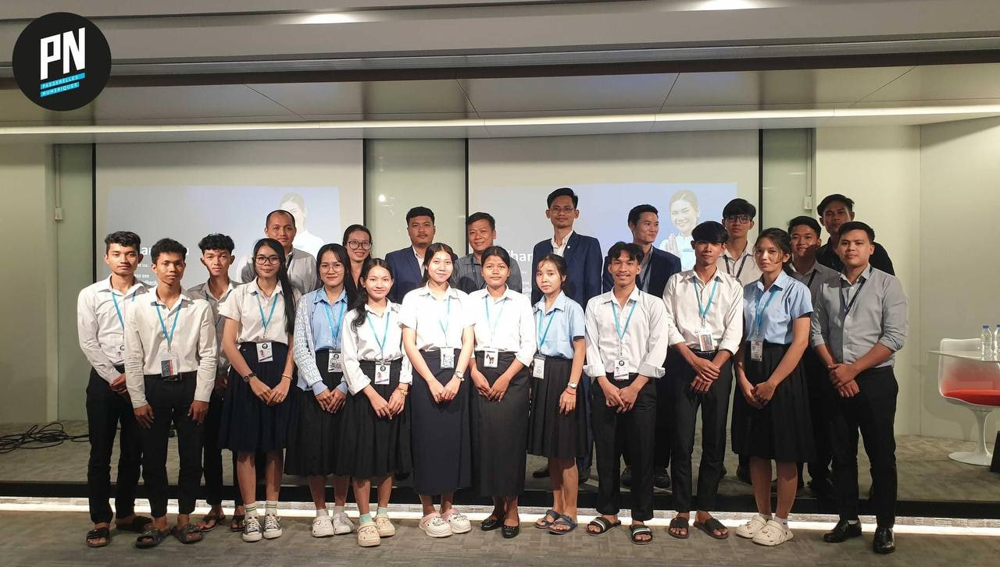

# School management

## screenshot

### Homepage

### Teacher

### Visit company

### Student

### Workshop

### Parntership

## Functions
### Teacher
First the teacher will apply for job,if he/she gets selected there accounts will be made and approved by the admin, after teacher always motivation student and teach with smile and pay attention to all student
### Student
student learn at PNC is poor student and from to hometown they don't have money to learn continue but they want to learn 
student in the PNC is friendly and communication to other
### School 
PNC create in 2005 right now 2025 PNC have 151 students
and have a lot of partner PNC focaus on web development for student and student can learn for year.
## 5 value in PNC
- `Respect`

- `Trust`

- `responsibility`

- `expect`

- `Responsibility`

## Address
>location BP 511 St. 371 Phum Tropeang Chhuk (Borey Sorla)
Sangkat Tek Thla, Khan Sen Sok
Phnom Penh CAMBODIA 
---
>Email info.cambodia@passerellesnumeriques.org

---
>Phone  +855 23 99 55 00

## Link
https://www.passerellesnumeriques.org/what-we-do/cambodia/

https://www.youtube.com/@PasserellesNumeriques

